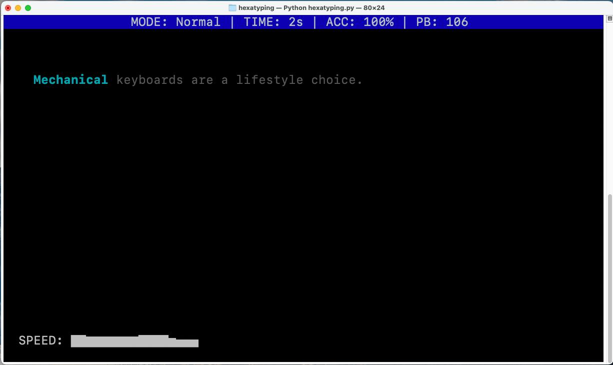
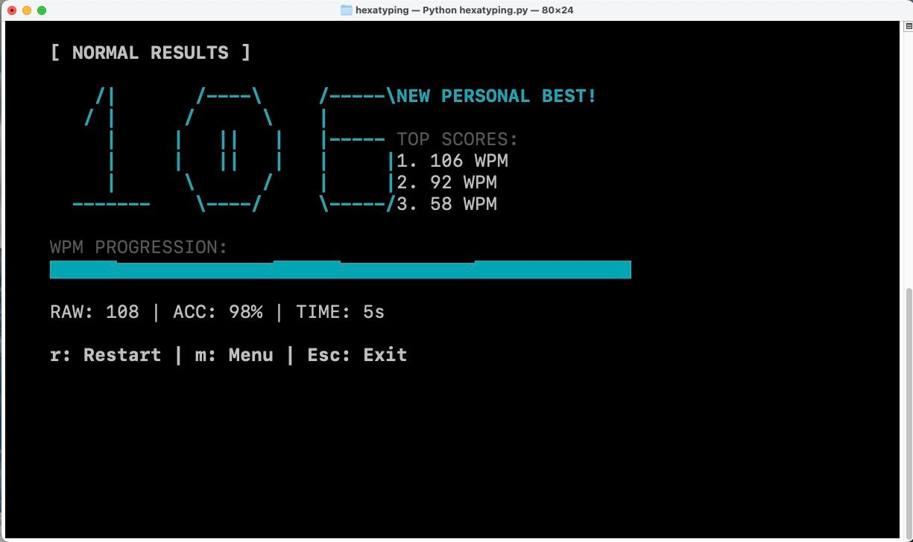

```
__                                      __                          __                     
|  \                                    |  \                        |  \                    
| $$____    ______   __    __  ______  _| $$_    __    __   ______   \$$ _______    ______  
| $$    \  /      \ |  \  /  \|      \|   $$ \  |  \  |  \ /      \ |  \|       \  /      \ 
| $$$$$$$\|  $$$$$$\ \$$\/  $$ \$$$$$$\\$$$$$$  | $$  | $$|  $$$$$$\| $$| $$$$$$$\|  $$$$$$\
| $$  | $$| $$    $$  &gt;$$  $$ /      $$ | $$ __ | $$  | $$| $$  | $$| $$| $$  | $$| $$  | $$
| $$  | $$| $$$$$$$$ /  $$$$\|  $$$$$$$ | $$|  \| $$__/ $$| $$__/ $$| $$| $$  | $$| $$__| $$
| $$  | $$ \$$     \|  $$ \$$\\$$    $$  \$$  $$ \$$    $$| $$    $$| $$| $$  | $$ \$$    $$
 \$$   \$$  \$$$$$$$ \$$   \$$ \$$$$$$$   \$$$$  _\$$$$$$$| $$$$$$$  \$$ \$$   \$$ _\$$$$$$$
                                                |  \__| $$| $$                    |  \__| $$
                                                 \$$    $$| $$                     \$$    $$
                                                  \$$$$$$  \$$                      \$$$$$$
```
Hexatyping is a minimalist, terminal-based typing tester (TUI) built for Linux power users, developed in Python. 
It features 5 distinct modes designed to help you master both typing speed and technical knowledge.

There are 5 modes:

    1)Normal: Standard English sentences.[Good for a standart typing test]

    2)Programming: Actual code syntax (Python, C++, etc.).[Helps in practing syntax along with typing]

    3)General Knowledge: Science and History facts.[Increases your knowledge alongside typing speed]

    4)Programming Knowledge: CS concepts and definitions.[Increases your CS knowledge alongside typing speed]

    5)OS Commands: Essential Linux/Bash commands.[Helps in practicng commands along with typing]

Features:

    1)Mode-Specific Leaderboards: High scores are tracked separately for each category.

    2)Live WPM Graph: See your speed fluctuations in real-time.

    3)Technical Content: Practice with real OS commands and programming snippets.

    4)PB System: Saves your best runs to ~/.hexatype_scores.
    
    5)Adjusted WPM: Adjusts your WPM according to your inacuracies.

Installation:
To install hexatype, use:
    ```bash
    git clone https://github.com/Hexa-Programmer/hexatyping.git
    cd hexatyping
    python hexatyping.py
    ```
Even better if u use arch, btw:
    ```
yay -S hexatyping
    ```

Note: This project was developed by Hexa Programmer. The content for the modes (sentences) was generated by AI, and I used AI to assist with debugging and refining the terminal rendering logic.




